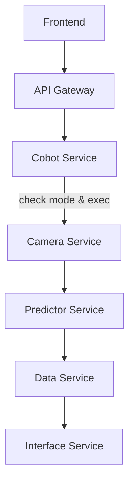

以下เป็นเอกสารที่เรียบเรียงใหม่โดยเน้นที่การออกแบบและใช้งาน API เป็นหลัก พร้อมปรับส่วนของ **Cobot Service** ให้สอดคล้องกับโค้ดใน `app/api/v1/endpoints.py`:

---

## 1. ภาพรวมโครงการ (Project Overview)

* **ชื่อโครงการ**: Microplate AI System
* **จุดประสงค์**: ใช้ภาพจากกล้องอ่านผลบน Microplate แทนคน (Automated Microplate Reading)
* **องค์ประกอบหลัก**:

  * **Cobot**: Dobot MG400
  * **Camera & QR Scanner**: จับภาพแผ่น Microplate, อ่าน QR code
  * **Backend**:

    * API Gateway (Node.js/Express หรือ Python/FastAPI)
    * Micro‑services: Auth, Cobot, Camera, Predictor, Data, Interface
  * **Frontend**: Next.js + TypeScript + MUI
  * **Database**: PostgreSQL
  * **Cache/Token Store**: Redis

---

## 2. โครงสร้างบริการ (Service Architecture)

```text
├─ services/
│   ├─ gateway-service    (port:3100)  # API Gateway
│   ├─ auth-service       (port:3101)  # Authentication & Token
│   ├─ cobot-service      (port:3102)  # Cobot Control (FastAPI)
│   ├─ camera-service     (port:3103)  # Image Capture & QR Scanner
│   ├─ predictor-service  (port:3104)  # Computer Vision Prediction
│   ├─ data-service       (port:3105)  # PostgreSQL Access
│   └─ interface-service  (port:3106)  # Labware Integration
└─ frontend      (Next.js, port:3107)
```

---

## 3. Data Schemas (app/models/schemas.py)

```ts
// รับรองว่าอ้างอิงตรงกับโค้ดของคุณ
export interface MoveRequest {
  point: string;
  speedj?: number;
  accj?: number;
}

export interface GripRequest {
  action: 'close' | 'open';
}

export interface RobotStatus {
  mode: number;           // รหัสสถานะปัจจุบันของหุ่นยนต์
  last_response: string;  // ข้อความผลลัพธ์จากคำสั่งล่าสุด
}
```

---

## 4. API Reference

### 4.1 API Gateway (port 3100)

* **Base URL**: `http://<host>:3100/api/v1`
* **หน้าที่**:

  * Aggregation ของทุก micro‑service
  * Authentication (JWT Bearer)
  * Rate Limiting
  * Proxy request ไปยังแต่ละ service

---

### 4.2 Auth Service (port 3101)

| Endpoint        | Method | Payload                                | Response                     |
| --------------- | ------ | -------------------------------------- | ---------------------------- |
| `/auth/signup`  | POST   | `{ username, email, password, roles }` | `{ accessToken, expiresIn }` |
| `/auth/login`   | POST   | `{ username, password }`               | `{ accessToken, expiresIn }` |
| `/auth/refresh` | POST   | `{ refreshToken }`                     | `{ accessToken }`            |

* เก็บ **accessToken** ใน Redis พร้อม TTL (e.g. 3500 วินาที)
* ใช้ middleware ตรวจสอบสิทธิ์ก่อนส่งต่อไปยัง service อื่น

---

### 4.3 Cobot Service (port 3102)

> **Prefix:** `/api/v1/cobot`
> **Security:**
>
> * ใช้ `HTTPBearer` ตรวจสอบ JWT ผ่าน dependency `verify_token`
> * ถ้าโทเค็นไม่ถูกต้อง คืนค่า `401 Unauthorized`

#### 4.3.1 Dependencies

* **`verify_token`**
  ตรวจสอบ JWT signature ด้วย `Config.JWT_SECRET_KEY`
* **`get_robot`**
  ดึง instance ของ `DobotMG400` และตำแหน่ง (points) จาก `app.state`

#### 4.3.2 Endpoints

| Path          | Method | Summary                  | Request Body  | Response Model | Notes                                                         |
| ------------- | ------ | ------------------------ | ------------- | -------------- | ------------------------------------------------------------- |
| `/reset`      | POST   | Reset & clear errors     | —             | `RobotStatus`  | รันคำสั่ง `reset`, `clear_error`, `continue_` แล้วอ่านโหมด    |
| `/enable`     | POST   | Enable robot motors      | —             | `RobotStatus`  | เปิดมอเตอร์, คืนค่าโหมดล่าสุด                                 |
| `/disable`    | POST   | Disable robot motors     | —             | `RobotStatus`  | ปิดมอเตอร์ (mode = -1)                                        |
| `/move`       | POST   | Move to predefined point | `MoveRequest` | `RobotStatus`  | ตรวจ `req.point` ใน points; สั่ง `movj`, รอ `wait_until_idle` |
| `/grip`       | POST   | Open/Close gripper       | `GripRequest` | `RobotStatus`  | ถ้า `action=='close'` → `close_grip()` else `release()`       |
| `/di/{index}` | GET    | Read digital input (0–7) | —             | `RobotStatus`  | อ่าน input ผ่าน `di_execute(index)`                           |
| `/status`     | GET    | Get current robot mode   | —             | `RobotStatus`  | อ่าน `robot.robot_mode()`                                     |

#### 4.3.3 ตัวอย่างการใช้งาน

##### 1) Reset & Clear Errors

```http
POST /api/v1/cobot/reset
Authorization: Bearer <accessToken>
```

**Response**

```json
{
  "mode": 0,
  "last_response": "OK;OK;OK;"
}
```

---

##### 2) Move to Point

```http
POST /api/v1/cobot/move
Authorization: Bearer <accessToken>
Content-Type: application/json

{
  "point": "pickup",
  "speedj": 100,
  "accj": 50
}
```

**Response**

```json
{
  "mode": 1,
  "last_response": "movj cmd_id=42"
}
```

---

##### 3) Read Digital Input

```http
GET /api/v1/cobot/di/3
Authorization: Bearer <accessToken>
```

**Response**

```json
{
  "mode": 1,
  "last_response": "DI[3]=0;"
}
```

---

### 4.4 Camera Service (port 3103)

| Endpoint          | Method | Payload                  | Response                                 |
| ----------------- | ------ | ------------------------ | ---------------------------------------- |
| `/camera/status`  | GET    | —                        | `{ status: "OK" }`                       |
| `/camera/scan-qr` | POST   | `{ imageBase64: "..." }` | `{ qrData: "...", status: "SUCCESS" }`   |
| `/camera/capture` | POST   | `{ trigger: true }`      | `{ imageUrl: "...", status: "SUCCESS" }` |

---

### 4.5 Predictor Service (port 3104)

| Endpoint             | Method | Payload                               | Response                                           |
| -------------------- | ------ | ------------------------------------- | -------------------------------------------------- |
| `/predictor/predict` | POST   | `{ imageUrl: "...", plateId: "..." }` | `{ results: [{ well: "A1", value: 0.123 }, ...] }` |

---

### 4.6 Data Service (port 3105)

| Endpoint                     | Method | Payload                          | Response                             |
| ---------------------------- | ------ | -------------------------------- | ------------------------------------ |
| `/data/raw-predict`          | POST   | `{ plateId, rawPredict: {...} }` | `{ id, success: true }`              |
| `/data/raw-predict/{id}`     | GET    | —                                | `{ id, plateId, rawPredict: {...} }` |
| `/data/images`               | POST   | `{ plateId, imageBase64 }`       | `{ id, success: true }`              |
| `/data/images/{id}`          | GET    | —                                | `{ id, plateId, imageUrl }`          |
| `/data/results`              | POST   | `{ plateId, results: [...] }`    | `{ id, success: true }`              |
| `/data/interface-results`    | POST   | *(background job)*               | `{ id, success: true }`              |
| *(เพิ่มเติมตาม README เดิม)* |        |                                  |                                      |

---

### 4.7 Labware Integration Service (port 3106)

| Endpoint                    | Method | Payload                           | Response                                  |
| --------------------------- | ------ | --------------------------------- | ----------------------------------------- |
| `/labware/login`            | POST   | `{ username, password }`          | `{ accessToken, expiresIn }`              |
| `/labware/results`          | POST   | `{ token, plateId, data: [...] }` | `{ status: "received" }`                  |
| `/labware/interface-status` | GET    | —                                 | `{ plateId, interfaceStatus, timestamp }` |
| `/labware/status/stream`    | GET    | —                                 | **Server-Sent Events**                    |

---

## 5. Workflow Sequence




