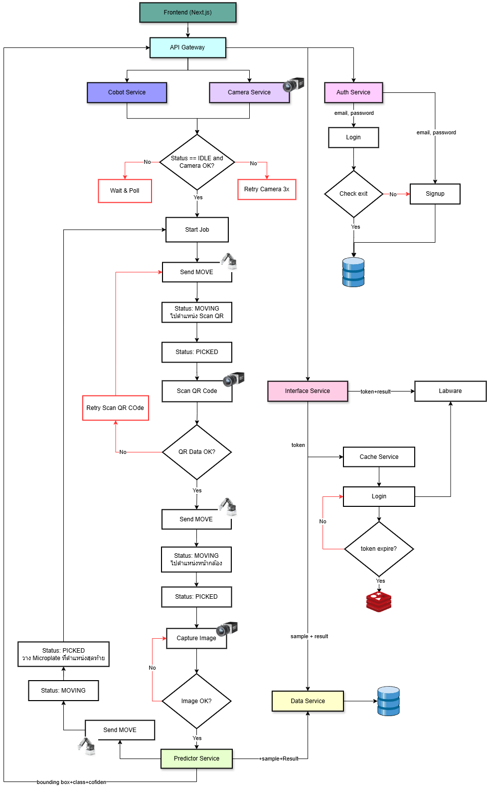

# Microplate AI System Architecture

## 1. ภาพรวมโปรเจกต์

* **ชื่อโครงการ**: Microplate AI System
* **จุดประสงค์**: ใช้ภาพจากกล้องอ่านผลบน Microplate แทนคน
* **องค์ประกอบหลัก**:

  * **Cobot**: Dobot MG400
  * **Camera & QR Scanner**: จับภาพแผ่น Microplate และอ่าน QR code
  * **Backend**: API Gateway + Micro-services (Node.js/Express หรือ Python/FastAPI)
  * **Frontend**: Next.js + TypeScript + MUI
  * **Database**: PostgreSQL
  * **Cache/Token Store**: Redis

## 2. โครงสร้าง Micro-service

แต่ละบริการแยกโฟลเดอร์ และมีโครงสร้างดังนี้:

```
/mono-repo /
├── services/
|      ├── gateway-service(port:3100)/         # API Gateway
|      │   ├── src/
|      |   |     |── configs/
|      |   |     |── models/
|      |   |     |── middleware/
|      |   |     |── services/
|      |   |     |── routes/
|      |   |     |── utils/
|      |   |     └── server.ts
|      │   ├── .env.gateway
|      │   ├── Dockerfile
|      │   ├── .dockerignore
|      │   ├── package.json
|      │   └── tsconfig.json
|      ├── auth-service(port:3101)/            # Authentication & Token Management
|      │   ├── src/
|      |   |     |── configs/
|      |   |     |── models/
|      |   |     |── middleware/
|      |   |     |── services/
|      |   |     |── routes/
|      |   |     |── utils/
|      |   |     └── server.ts
|      │   ├── .env.auth
|      │   ├── Dockerfile
|      │   ├── .dockerignore
|      │   ├── package.json
|      │   └── tsconfig.json
|      ├── cobot-service(port:3102)/           # ควบคุม Cobot
|      │   ├── app/
|      │   │   ├── api/
|      |   |   |    |── v1/
|      │   │   ├── models/
|      │   │   ├── services/
|      │   │   ├── utils/
|      │   │   ├── config.py
|      │   │   └── main.py
|      │   ├── .env.cobot
|      │   ├── Dockerfile
|      │   ├── .dockerignore
|      │   └── requirements.txt
|      ├── camera-service(port:3103)/          # ถ่ายภาพ + สแกน QR
|      │   ├── app/
|      │   │   ├── api/
|      |   |   |    |── v1/
|      │   │   ├── models/
|      │   │   ├── services/
|      │   │   ├── utils/
|      │   │   ├── config.py
|      │   │   └── main.py
|      │   ├── .env.camera
|      │   ├── Dockerfile
|      │   ├── .dockerignore
|      │   └── requirements.txt
|      ├── predictor-service(port:3104)/       # Computer Vision Prediction
|      │   ├── app/
|      │   │   ├── api/
|      |   |   |    |── v1/
|      │   │   ├── models/
|      │   │   ├── services/
|      │   │   ├── utils/
|      │   │   ├── config.py
|      │   │   ├── database.py
|      │   │   └── main.py
|      │   ├── .env.predictor
|      │   ├── Dockerfile
|      │   ├── .dockerignore
|      │   └── requirements.txt
|      ├── data-service(port:3105)/            # เขียน/อ่านข้อมูลจาก PostgreSQL
|      │   ├── src/
|      |   |     |── configs/
|      |   |     |── models/
|      |   |     |── middleware/
|      |   |     |── services/
|      |   |     |── routes/
|      |   |     |── utils/
|      |   |     └── server.ts
|      │   ├── .env.data
|      │   ├── Dockerfile
|      │   ├── .dockerignore
|      │   ├── package.json
|      │   └── tsconfig.json
|      └── interface-service(port:3106)/       # ส่งข้อมูลไป Labware
|          ├── src/
|          |     |── configs/
|          |     |── models/
|          |     |── middleware/
|          |     |── services/
|          |     |── routes/
|          |     |── utils/
|          |     └── server.ts
|          ├── .env.interface
|          ├── Dockerfile
|          ├── .dockerignore
|          ├── package.json
|          └── tsconfig.json
├── cache-service(port:6379)/           # Redis (session, token cache)
├── frontend(port:3107)/                # Next.js + TS + MUI
|    └── nextjs-app/
├── infrastructure/
│    └── docker-compose.yml
├── .env.common
└── README.md
```

### ชื่อบริการ (Service Names)

| ชื่อโฟลเดอร์           | บริการ                                |   port    |
| ------------------- | ------------------------------------ |---------- |
| `gateway-service`   | API Gateway                          |    3100   |
| `auth-service`      | Authentication & Token Service       |    3101   |
| `cobot-service`     | Cobot Control Service                |    3102   |
| `camera-service`    | Camera & QR Scanner Service          |    3103   |
| `predictor-service` | Prediction (Computer Vision) Service |    3104   |
| `data-service`      | Data Access Service                  |    3105   |
| `interface-service` | Labware Integration Service          |    3106   |
| `cache-service`     | Redis Cache Service                  |    6379   |
| `frontend`          | Frontend Application                 |    3107   |

## 3. API Design

### 3.1 API Gateway

* **Base URL**: `/api/v1`
* **ใช้ทำ Authentication, Rate Limiting, Proxy ไปยัง Micro-services**

### 3.2 Auth Service

| Endpoint        | Method | Request                                                                     | Response                                      |
| --------------- | ------ | --------------------------------------------------------------------------- | --------------------------------------------- |
| `/auth/signup`  | POST   | `{ "username": "...", "email": "...", "password": "...", "roles": "user" }` | `{ "accessToken": "...", "expiresIn": 3600 }` |
| `/auth/login`   | POST   | `{ "username": "...", "password": "..." }`                                  | `{ "accessToken": "...", "expiresIn": 3600 }` |
| `/auth/refresh` | POST   | `{ "refreshToken": "..." }`                                                 | `{ "accessToken": "..." }`                    |

### 3.3 Cobot Service

* **Base URL**: `/api/v1/cobot`

```yaml
paths:
  /status:
    get:
      summary: Get current Cobot status
      responses:
        '200':
          content:
            application/json:
              schema:
                type: object
                properties:
                  status:
                    type: string
                    enum: [IDLE, MOVING, PICKED, SCANNING, PLACED, ERROR]
```

**ตัวอย่าง Response**:

```json
{
  "status": "SCANNING",
  "updatedAt": "2025-05-03T04:00:00Z"
}
```

### 3.4 Camera Service

| Endpoint          | Method | Request                    | Response                |
| ----------------- | ------ | -------------------------- | ----------------------- |
| `/camera/status`  | POST   | —                          | `{ "status": "OK" }`    |
| `/camera/scan-qr` | POST   | `{ "imageBase64": "..." }` | `{ "qrData": "..." }`   |
| `/camera/capture` | POST   | `{ "trigger": true }`      | `{ "imageUrl": "..." }` |

### 3.5 Predictor Service

| Endpoint             | Method | Request                                   | Response                                                 |
| -------------------- | ------ | ----------------------------------------- | -------------------------------------------------------- |
| `/predictor/predict` | POST   | `{ "imageUrl": "...", "plateId": "..." }` | `{ "results": [ {"well": "A1", "value": 0.123}, ... ] }` |

### 3.6 Data Service

| Endpoint                       | Method | Request                                                       | Response                                                       |
| ------------------------------ | ------ | ------------------------------------------------------------- | -------------------------------------------------------------- |
| `/data/raw-predict`            | POST   | `{ "plateId": "...", "rawPredict": {...} }`                   | `{ "id": "...", "success": true }`                             |
| `/data/raw-predict`            | GET    | —                                                             | `{ "items": [ { "id": "...", ... } ] }`                        |
| `/data/raw-predict/{id}`       | GET    | —                                                             | `{ "id": "...", "plateId": "...", "rawPredict": {...} }`       |
| `/data/raw-predict/{id}`       | PUT    | `{ "rawPredict": {...} }`                                     | `{ "success": true }`                                          |
| `/data/raw-predict/{id}`       | DELETE | —                                                             | `{ "success": true }`                                          |
| `/data/images`                 | POST   | `{ "plateId": "...", "imageBase64": "..." }`                  | `{ "id": "...", "success": true }`                             |
| `/data/images/{id}`            | GET    | —                                                             | `{ "id": "...", "plateId": "...", "imageUrl": "..." }`         |
| `/data/results`                | POST   | `{ "plateId": "...", "results": [...] }`                      | `{ "id": "...", "success": true }`                             |
| `/data/results`                | GET    | —                                                             | `{ "items": [ { "id": "...", ... } ] }`                        |
| `/data/results/{id}`           | GET    | —                                                             | `{ "id": "...", "plateId": "...", "results": [...] }`          |
| `/data/results/{id}`           | PUT    | `{ "results": [...] }`                                        | `{ "success": true }`                                          |
| `/data/results/{id}`           | DELETE | —                                                             | `{ "success": true }`                                          |
| `/data/interface-results`      | POST   | *(Triggered by background job to calculate interface result)* | `{ "id": "...", "success": true }`                             |
| `/data/interface-results`      | GET    | —                                                             | `{ "items": [ { "id": "...", ... } ] }`                        |
| `/data/interface-results/{id}` | GET    | —                                                             | `{ "id": "...", "sampleNo": "...", "interfaceResult": {...} }` |
| `/data/interface-results/{id}` | PUT    | `{ "interfaceResult": {...} }`                                | `{ "success": true }`                                          |
| `/data/interface-results/{id}` | DELETE | —                                                             | `{ "success": true }`    

### 3.7 Labware Integration Service

| Endpoint                    | Method | Request                                               | Response                                                                 |
| --------------------------- | ------ | ----------------------------------------------------- | ------------------------------------------------------------------------ |
| `/labware/login`            | POST   | `{ "username": "...", "password": "..." }`            | `{ "accessToken": "...", "expiresIn": 3600 }`                            |
| `/labware/results`          | POST   | `{ "token": "...", "plateId": "...", "data": [...] }` | `{ "status": "received" }`                                               |
| `/labware/interface-status` | GET    | —                                                     | `{ "plateId": "...", "interfaceStatus": "SUCCESS", "timestamp": "..." }` |
| `/labware/status/stream`    | GET    | —                                                     | **Server-Sent Events**: stream JSON `{ plateId, interfaceStatus }`       |                  |

## 4. Cobot Status Model

```ts
export enum CobotStatus {
  IDLE = 'IDLE',
  MOVING = 'MOVING',
  PICKED = 'PICKED',
  SCANNING = 'SCANNING',
  PLACED = 'PLACED',
  ERROR = 'ERROR',
}
```

## 5. Workflow Sequence

1. **Frontend** (Next.js) ขอสถานะ Cobot และ Camera →
2. **Gateway** → **Cobot Service** คืนสถานะ
3. หาก `IDLE` → ผู้ใช้สั่งเริ่มงาน → **Cobot Service** ส่งคำสั่ง `MOVE`
4. Cobot เคลื่อนที่ไปยังตำแหน่ง → สถานะเป็น `MOVING` → เมื่อถึง → `PICKED` →
5. Cobot วางแผ่นที่กล้อง → สถานะ `SCANNING` → **Camera Service** ถ่ายภาพ + สแกน QR
6. ส่ง `imageUrl` → **Predictor Service** อ่านผลค่าต่างๆ → คืน `results`
7. **Data Service** บันทึกผลลง PostgreSQL
8. **Interface Service** ดึงข้อมูลจาก Data Service → ส่งต่อไปยัง **Labware** ผ่าน REST API

### Retry / Error Handling

* หากเรียก Camera หรือ Predictor ล้มเหลว → Retry 3 ครั้ง (exponential backoff) → ส่งสถานะ `ERROR` กลับไปยัง Frontend
* สำหรับ Labware Integration: retry 5 ครั้ง ทุก 10 วินาที หากยังล้มเหลว → log error และแจ้ง notification

      


## 6. Integration กับระบบ Labware

1. **Login & Token Management**

   * Auth Service จัดการ JWT + Refresh Token
   * เก็บ `accessToken` ใน Redis พร้อม TTL (เช่น 3500 วินาที)
   * Middleware ตรวจสอบ token ก่อนเชื่อมต่อ Labware

2. **Endpoint ส่งผลทดสอบ**

   * `POST /labware/results`
   * Header: `Authorization: Bearer <accessToken>`
   * Payload: `{ plateId, data: [...], timestamp }`

## 7. Tool Stack & Infrastructure

* **Frontend**: Next.js, TypeScript, MUI
* **Backend**: Node.js/Express หรือ Python/FastAPI
* **Database**: PostgreSQL (HA, Read Replica)
* **Cache**: Redis (Session, Token Store)
* **Containerization**: Docker + Docker Compose / Kubernetes (Helm Charts)
* **CI/CD**: GitHub Actions หรือ GitLab CI (build, test, lint, deploy)
* **Logging & Monitoring**: ELK Stack (Elasticsearch, Logstash, Kibana), Prometheus + Grafana
* **Testing**: Jest / Pytest, Supertest / HTTPX
* **Security**: JWT, RBAC, HTTPS, OWASP Top 10 checks
* **Secrets Management**: Vault / GitHub Secrets / Kubernetes Secrets
* **Environment Variables**: ใช้ `.env` + `dotenv` หรือ ConfigMap in Kubernetes

## 8. Quality of Service

* **Error Handling & Retry Policy**: Exponential backoff, circuit breaker pattern (e.g., with `opossum`)
* **Logging**: Structured logs (JSON), correlation IDs สำหรับ trace
* **Monitoring & Alerting**: Prometheus metrics + Grafana dashboards, Alertmanager alerts (Slack, Email)
* **Authentication & Authorization**: JWT-based, role-based access control (RBAC)
* **Scalability & Resilience**: Horizontal Pod Autoscaling (K8s), health probes (liveness, readiness), circuit breaker
* **Backup & Restore**: Automated DB backups (daily), point-in-time recovery

---

*เอกสารฉบับนี้สรุปโครงสร้างระบบ Microplate AI System พร้อมตัวอย่างโค้ดสำหรับ API และแนวทางการจัดการด้าน Infrastructure & Quality of Service เพื่อความพร้อมใช้งานและขยายตัว*
